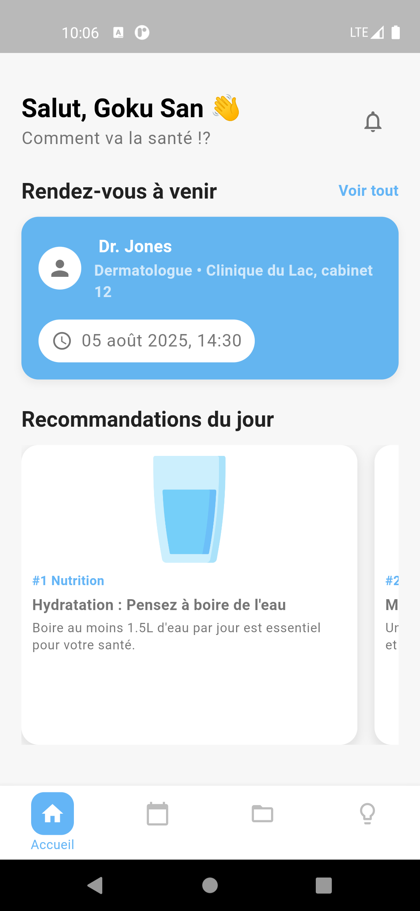
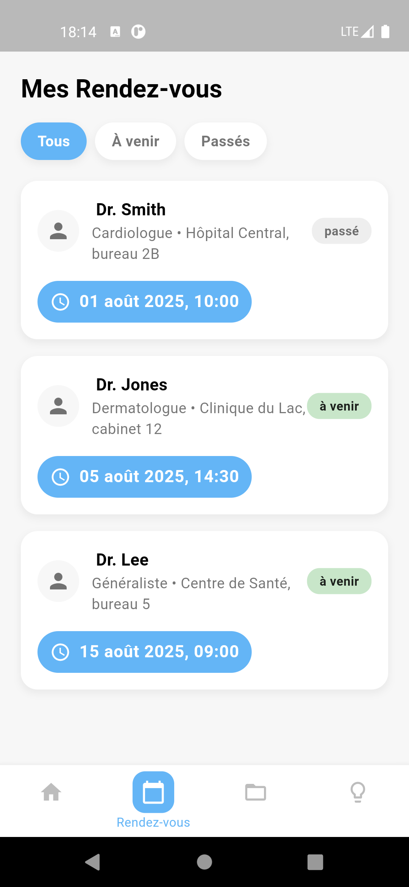
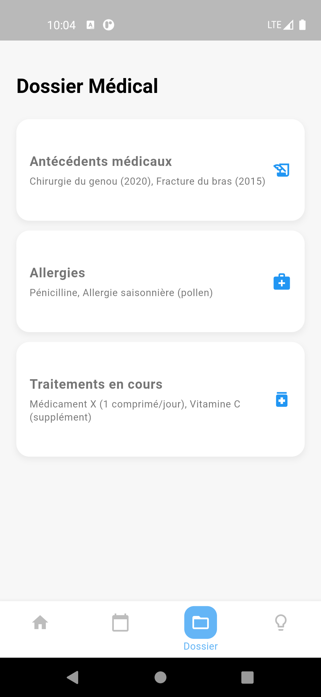
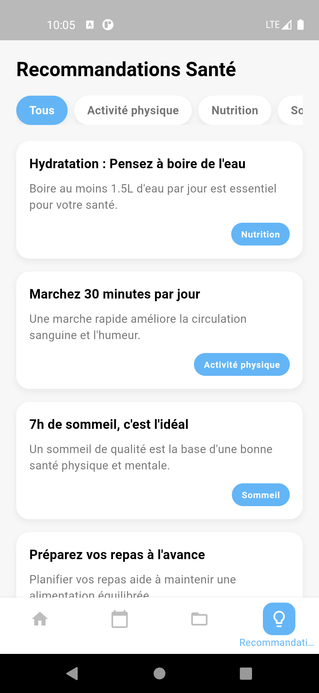

Portail Patient - Application Mobile Flutter

Salut ! Bienvenue sur le projet "Portail Patient", une application mobile développée avec Flutter. L'idée, c'est de créer une interface super simple et conviviale pour que les patients puissent accéder à leurs infos santé importantes.

## Objectifs du Projet

L'objectif principal de cette application est de fournir aux patients un accès facile à :

* **Leurs informations personnelles** : un aperçu rapide de qui ils sont.
* **Leurs rendez-vous médicaux** : voir les rendez-vous à venir et ceux qui sont passés.
* **Des recommandations de santé personnalisées** : des conseils pour rester en forme.
* **Leur dossier médical simplifié** : un résumé de leurs antécédents, allergies et traitements.

On a cherché à rendre l'expérience utilisateur fluide et agréable, avec un design clair et des animations sympas.

## Note importante

Cette application ne dispose pas de backend ni de base de données. Toutes les données sont chargées de manière statique à partir de fichiers JSON locaux situés dans le dossier /assets. Ces fichiers simulent une API, permettant à l'application de fonctionner de manière autonome.

## Instructions d'exécution

Pour faire tourner cette application, suivre ces étapes :

### Pré-requis

S'assurer d'avoir installé :

* **Flutter SDK** : version compatible avec le projet. (Flutter 3.22.0 • channel stable) par exemple.
* Un éditeur de code (VS Code, Android Studio, etc.) avec le plugin Flutter.
* Un émulateur Android/iOS ou un appareil physique connecté.

### Lancement de l'application

1.  **Cloner le dépôt** (si ce n'est pas déjà fait) :
    `git clone https://github.com/sirius-code7/Portail-Patient.git`
    `cd portail_patient`

2.  **Récupèrer les dépendances** :
    Ouvrir un terminal dans le dossier du projet et exécuter :
    `flutter pub get`

3.  **Vérifier les assets** :
    S'assurer que toutes les images utilisées (`hydration_water_glass.png`, `walking-man.png`, `sleeping.png`, etc.) sont bien dans le dossier `assets/images/` et que le `pubspec.yaml` les référence correctement.

4.  **Lancer l'application** :
    Connecter un appareil ou démarrer un émulateur, puis exécuter :
    `flutter run`

    L'application devrait se lancer et il sera possible de naviguer entre les différentes sections.

## Captures d'écran

Voici un aperçu de l'application en action :

### Écran d'Accueil

### Écran des Rendez-vous

### Écran du Dossier Médical

### Écran des Recommandations

## Note Importante

Ce projet a été développé sans l'aide d'outils comme ChatGPT. Tout le code et les commentaires ont été produits manuellement pour garantir une compréhension et une personnalisation complètes.
